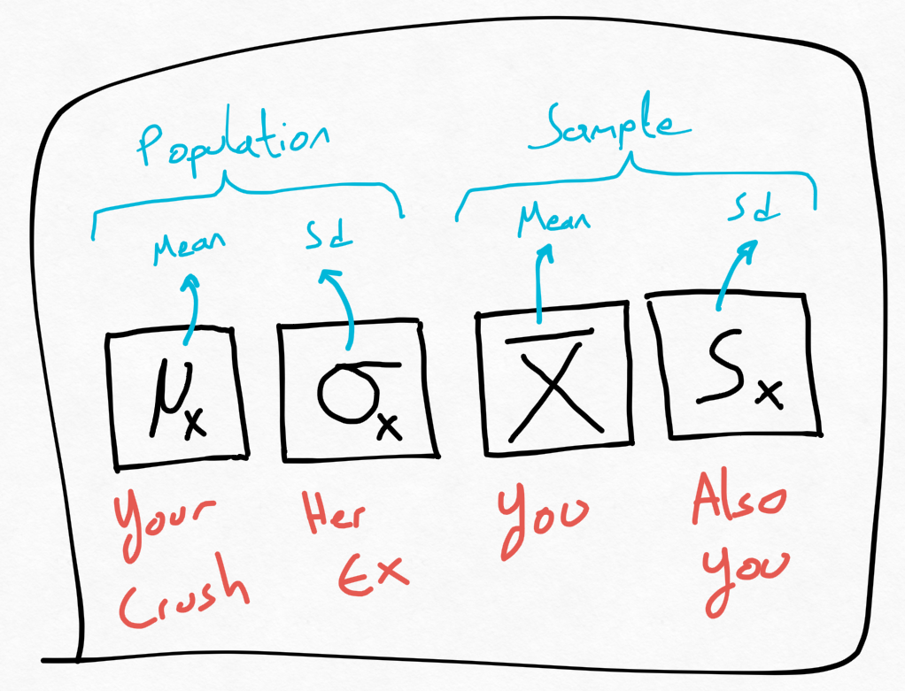
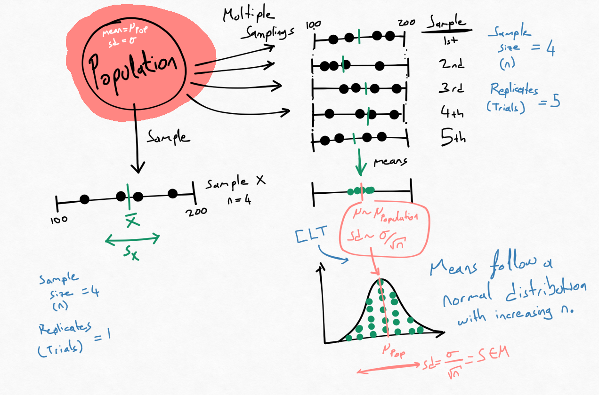
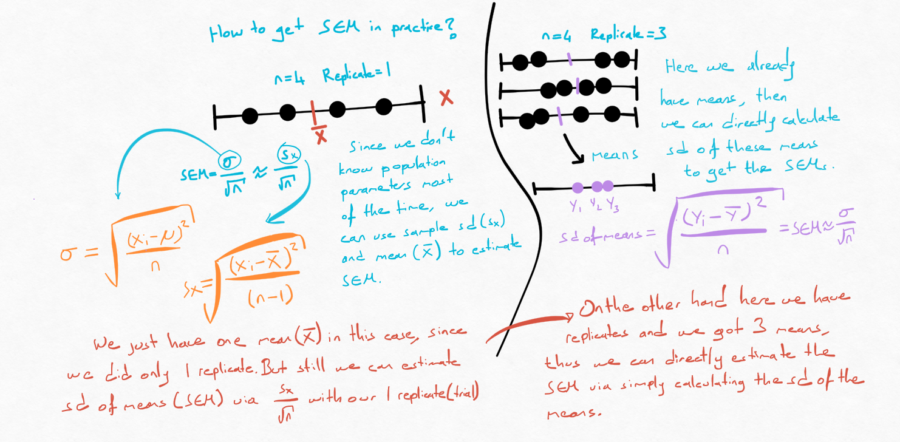

```{r setup, include=FALSE}
knitr::opts_chunk$set(echo = FALSE)
```

```{r}
library(plyr)
library(tidyverse)
library(cowplot)
library(tinytex)
```

## Intro

In the last post we bought thousands of mice to get the null distribution of the mouse weights. But we cannot do that every time can we? At this point **statistical inference** comes to the rescue, which helps us to *infer* the probability of observing certain outcome, with just from small amount of samples. It can do its magic because sometimes the values we have can be approximated with a certain distribution. Our mean weight differences, when plotted follows a normal distribution for example (red line). Thus if such a distribution is applicable to our values one can use that distribution to get an approximate probability of certain outcome. 

```{r, fig.cap= "Null distribution from last post"}
nullplot <- readRDS("../../nullplot.rds")


p1 <- ggplot()+
  geom_histogram(data = nullplot , fill = "black" , binwidth = 0.1,mapping = aes(x=null, y = ..density..))
p2 <- ggplot()+
  geom_histogram(data = nullplot , fill = "black" , binwidth = 0.1,mapping = aes(x=null, y = ..density..))+
  stat_function(data = nullplot,fun = dnorm, args = list(mean = mean(nullplot$null), sd = sd(nullplot$null)), size = 2, color= "firebrick")

plot_grid(p1,p2)
```

Ok, let's use normal distribution, but how can we adjust this distribution to fit our data? In order to define a normal distribution we need two values: **mean**(μ) and **standard deviation**(σ) of our population. (as one can see from the scary normal distribution formula)

$$
\mbox{f}(x) = \frac{1}{\sqrt{2\pi\sigma^2}} \exp{\left( \frac{-(x-\mu)^2}{2 \sigma^2} \right)}
$$

## Central Limit Theorem

```{r,fig.align ='center', fig.cap= "Population and Sample Parameters"}

```

So we need to estimate our **population mean**  $μ_X$ and **population sd** $\sigma_X$.

which we can do with our **sample mean** $\bar{X}$ and **sample sd** $s_X$, with the help of one and only Central Limit Theorem(CLT).

CLT says that when the sample size (N) is large, the average of these random samples $\bar{X}$ follow a normal distribution that has the mean of the population $μ_X$  and has a sd of $\frac{\sigma_X}{\sqrt{N}}$. 

In another words, imagine that we sample 30 people randomly and record the mean height. Then repeat this couple of times so that we have several means. Distribution of these sampling means would follow a normal distribution with the mean $μ_X$ and with sd $\frac{\sigma_X}{\sqrt{30}}$. 

Note that $\frac{\sigma_X}{\sqrt{N}}$ is also famously known as Standard Error of the Mean (SEM).

### What is SEM actually?

Standard Error of the Mean.. What a confusing name... But apparently this was not the case before. This is actually it is nick name it seems. Its full name is **"The estimated standard deviation of the sampling distribution of x-bar"** according to [this discussion](https://stats.stackexchange.com/questions/60484/why-is-the-formula-for-standard-error-the-way-it-is). Which is longer but more explanatory. As it suggests, SEM is just the standard deviation of the means($\bar{X}$) of your samples. So you took four measurements and calculated mean of it, repeated this 10 times. You get 10 means, standard deviation of these means is SEM.

<aside>
Ona sadece iş arkadaşları SEM der.


```{r,fig.align ='center', fig.cap= "Figure from: https://www.haberler.com/fotogaleri/yilan-hikayesi-nin-memoli-sinin-son-hali/"}
knitr::include_graphics("images/memoli.jpg")
```
</aside>

### Simulation with different sample sizes

Here I simulated different populations with different characteristics, each with size of 200.000, mean of μ = ~130 and sd of σ = ~34. On the left we see the different populations (bimodal, normal, uniform). I sampled from these populations with different sample sizes (n=2, 10, 30, 50), calculated the mean and repeated this process 100 times (green histograms). I also plotted two normal distributions and means. Black lines show the calculations done by using population parameters; normal distribution with sd of $\frac{\sigma_X}{\sqrt{N}}$ and mean: $μ_P$. Red lines show the empirical estimate from our sampling means; normal distribution with sd $s_X$ and mean $\bar{X}$.

<aside>
CLT 

*Ne olursan ol yine gel* 

diyen Mevlana,

*Ben insanın değerini bölemem*

*Doğu-batı, gavur-müslüm bir bana!* 

diyen Aşık Mahzuni Şerif gibi.
</aside>

Here one can see that actually even with sample size of 2 we get a quite accurate estimate of the mean and sd of the means(SEM). Although the actual mean calculations(histograms) are not completely normally distributed, it still resembles a normal distribution. As we increase the sample size we see that the distribution of the means get much more similar to the suggested normal distribution by CLT (with the mean of the population, and sd of $\frac{\sigma_X}{\sqrt{N}}$). 

Another thing that we can notice is that SEM decreases as we increase the sample size. We get much more accurate estimate of the real population mean with high N.

Lastly we have seen that CLT did not care about the population distribution too much. In the end we got normally distributed means.


```{r, layout="l-body-outset", fig.width=12, fig.height=6, fig.cap= "Sample size differences illustration"}
set.seed(1)

# I tried to look at deviation of sd when you take one replicate of sample size 30 vs 30 replicate of sample size 30. I wanted to see if our sd estimate varies differently. Like Standard error of standard error. 

#ankara_height <- rnorm(5000000, mean = 160, sd = 20)
#
#hist(ankara_height)
#
#vsd <-c()
#for(i in 1:100){
#  sankara <- replicate(mean(sample(ankara_height, 30)), n = 30)
#  vsd <- c(vsd,sd(sankara))
#}
#head(vsd)
#hist(vsd)
#
#sdPop(ankara_height, 5000000)
#
#vsd2 <-c()
#for(i in 1:100){
#  sankara <- replicate(sample(ankara_height, 30), n = 1)
#  vsd2 <- c(vsd2,sd(sankara))
#}
#head(vsd2)
#
#vsd2 <- vsd2/sqrt(30)
#
#sd(vsd)
#sd(vsd2)
#mean(vsd)
#mean(vsd2)
#mean(ankara_height)
#sd(ankara_height)/sqrt(30)
#


sdPop <- function(vector, n){
  sdsam <- sqrt(sum( (vector-mean(vector))^2) / n)
  return(sdsam)
}


n1 <- rnorm(100000, mean = 160, sd = 20)
n2 <- rnorm(100000, mean = 100, sd = 10)

bimod <- c(n1, n2)
#
#mean(bimod)
#sd(bimod)
#hist(bimod)

normd <- rnorm(200000, mean = 130, sd = 34)

#hist(normd)

uni <- runif(200000, 71,189)
#mean(uni)
#sd(uni)

datadists <- data.frame(bimod = bimod, normd = normd, uniform = uni)

datadists <- datadists %>%
  pivot_longer(cols = 1:3, names_to = "dist")

pd <- ggplot(datadists)+
  geom_histogram(aes(value, y = ..density..), bins = 113, fill =  "#f54876")+
  facet_grid(dist~.)+
  coord_cartesian(xlim = c(0,250))+
  theme_bw()+
  theme(
  strip.background = element_blank(),
  strip.text.y = element_blank()
)+
  ggtitle("Population Distributions")

datadistsSample <- datadists %>% 
  group_by(dist) %>%
  summarize(N2 = replicate(mean(sample(value, size = 2)),n = 100),
            N10 = replicate(mean(sample(value, size = 10)),n = 100),
            N30 = replicate(mean(sample(value, size = 30)),n = 100),
            N50 = replicate(mean(sample(value, size = 50)),n = 100))

datadistsSampleStat <- datadistsSample %>%
  summarise(meanN2 = mean(N2),
            meanN10 = mean(N10),
            meanN30 = mean(N30),
            meanN50 = mean(N50),
            sdN2 = sd(N2) ,
            sdN10 = sd(N10),
            sdN30 = sd(N30),
            sdN50 = sd(N50))


grid <- with(datadistsSample, seq(min(N2), max(N2), length = 100))
normaldens2 <- ddply(datadistsSample, "dist", function(datadistsSample) {
  data.frame( 
    N2 = grid,
    density = dnorm(grid, mean(datadistsSample$N2), sd(datadistsSample$N2) )
  )
})

grid <- with(datadistsSample, seq(min(N10), max(N10), length = 100))
normaldens10 <- ddply(datadistsSample, "dist", function(datadistsSample) {
  data.frame( 
    N10 = grid,
    density = dnorm(grid, mean(datadistsSample$N10),  sd(datadistsSample$N10) )
  )
})

grid <- with(datadistsSample, seq(min(N30), max(N30), length = 100))
normaldens30 <- ddply(datadistsSample, "dist", function(datadistsSample) {
  data.frame( 
    N30 = grid,
    density = dnorm(grid, mean(datadistsSample$N30),  sd(datadistsSample$N30) )
  )
})
grid <- with(datadistsSample, seq(min(N50), max(N50), length = 100))
normaldens50 <- ddply(datadistsSample, "dist", function(datadistsSample) {
  data.frame( 
    N50 = grid,
    density = dnorm(grid, mean(datadistsSample$N50),  sd(datadistsSample$N50) )
  )
})


p2 <- ggplot(data = datadistsSample, mapping = aes(x = N2))  + 
  geom_histogram(bins = 15, aes(y =  ..density..), fill = "#02a890") + 
  geom_line(mapping = aes(y = density), data = normaldens2, colour = "firebrick", size = 1.5) +
  facet_grid(dist~.)+
  geom_vline(data = datadistsSampleStat, aes(xintercept =meanN2), color = "firebrick")+
  geom_vline(data = datadistsSampleStat, aes(xintercept =130), color = "black")+
  stat_function(fun = dnorm, args = list(mean = 130, sd = 34 /sqrt(2)),  size = 1.5)+
  theme_bw()+
  theme(
  strip.background = element_blank(),
  strip.text.y = element_blank()
)+
  ylab("")+
  ggtitle("N = 2")+
  coord_cartesian(xlim = c(70,190))


p10 <- ggplot(data = datadistsSample, mapping = aes(x = N10))  + 
  geom_histogram(bins = 15, aes(y =  ..density..), fill = "#02a890") + 
  geom_line(mapping = aes(y = density), data = normaldens10, colour = "firebrick",  size = 1.5) +
  facet_grid(dist~.)+
  geom_vline(data = datadistsSampleStat, aes(xintercept =meanN10), color = "firebrick")+
  geom_vline(data = datadistsSampleStat, aes(xintercept =130), color = "black")+
  stat_function(fun = dnorm, args = list(mean = 130, sd = 34 /sqrt(10)),  size = 1.5)+
  theme_bw()+
  theme(
  strip.background = element_blank(),
  strip.text.y = element_blank()
)+
  ylab("")+
  ggtitle("N = 10")+
  coord_cartesian(xlim = c(70,190))


p30 <- ggplot(data = datadistsSample, mapping = aes(x = N30))  + 
  geom_histogram(bins = 15, aes(y =  ..density..), fill = "#02a890") + 
  geom_line(mapping = aes(y = density), data = normaldens30, colour = "firebrick",  size = 1.5) +
  facet_grid(dist~.)+
  geom_vline(data = datadistsSampleStat, aes(xintercept =meanN30), color = "firebrick")+
  geom_vline(data = datadistsSampleStat, aes(xintercept =130), color = "black")+
  stat_function(fun = dnorm, args = list(mean = 130, sd = 34 /sqrt(30)),  size = 1.5)+
  theme_bw()+
  theme(
  strip.background = element_blank(),
  strip.text.y = element_blank()
)+
  ylab("")+
  ggtitle("N = 30")+
  coord_cartesian(xlim = c(70,190))


p50 <- ggplot(data = datadistsSample, mapping = aes(x = N50))  + 
  geom_histogram(bins = 15, aes(y =  ..density..), fill = "#02a890") + 
  geom_line(mapping = aes(y = density), data = normaldens50, colour = "firebrick",  size = 1.5) +
  facet_grid(dist~.)+
  geom_vline(data = datadistsSampleStat, aes(xintercept =meanN50), color = "firebrick")+
  geom_vline(data = datadistsSampleStat, aes(xintercept =130), color = "black")+
  stat_function(fun = dnorm, args = list(mean = 130, sd = 34 /sqrt(50)),  size = 1.5)+
  theme_bw()+
  ylab("")+
  ggtitle("N = 50")+
  coord_cartesian(xlim = c(70,190))


plot_grid(pd,p2,p10,p30,p50, nrow = 1)

```


I would like to touch on a few points which always confused me. I think I finally got it. :)

### Sample size vs Replicates

I think sometimes it gets quite confusing to understand what the sample size is, at least for me.. If we look at the following figure, on the left side I took 4 samples. Let's say I took 4 mice and measured their weight and that is it. In this case I have a sample size of 4 and I only performed 1 trial/replicate. On the right side I took 4 mice again but repeated this 5 times in total. Here my sample size is 4 again and I just replicated it 5 times.

On the right bottom I also illustrated that as we do more replicates we would expect these sampling means from each replicate to form a normal distribution. Higher our sample size is, more it resembles a normal distribution according to CLT. In statistics they say minimum sample size should be 30 as a rule of thumb, but as we also seen in the simulation, sample size of 10 was also reasonably good. As far as I read this rule of thumb depends mostly on the distribution of the population. **Some confusing addition to this topic:** Furthermore, as we do a statistic test we divide mean differences with estimated standard deviation. With this additional division, sample size starts to matter more apparently [@dals]. But I haven't touched this part yet.

```{r, layout="l-body-outset", fig.width=8, fig.height=7,fig.align='center', fig.cap= "Sampling"}



## so when one measures 12 mice. you have no replicates but 12 samples. you can estimate SEM via sd of this sample / sqrt(12)
## when one measures 12 mice 3 times, one can take the means and calculate the sd of the means directly which gives the estimate for SEM

## In both cases one has same sample size. What does having replicates bring?
## For example if I replicate my experiment with multiple mice it then allows me to conclude about this mice strain.
## If I dont replicate I can only conclude about that mouse.

```
### How to calculate SEM in practice?
The thing that confused me a lot is how to calculate the SEM in practice, especially when you have or don't have replicates. In the next figure, on the left we measured weights of 4 mice again. According to $SEM = \frac{\sigma_X}{\sqrt{N}}$ we can get SEM. But since we don't have data from billions of mice that live in the world, we don't know the population standard deviation (σ). Good thing is we have sample sd ($s_X$) that we can use as estimate of σ. Sample standard deviation is calculated a little bit differently than population sd:  
$$s_X = \sqrt{\frac{(X_i - \bar{X})^2 }{\sqrt{N - 1}}}$$ 
We use sample mean and at denominator we have N-1 instead of N. This is simply because, when we estimate σ from sample sd we tend to underestimate it. Thus we boost it up by dividing with a smaller number. There is also a more logical explanations about this, which I can discuss later.

So we can calculate the $s_X$ with this formula and calculate the estimate for SEM via $SEM = \frac{s_X}{\sqrt{N}}$.

What if we have replicates? Then we already calculate mean for each replicate, thus we have more than one mean estimate. Thus one can directly calculate the sd of these means as usual to get the SEM. Which makes sense I think and also according to [this resource](https://sisu.ut.ee/measurement/33-standard-deviation-mean). THUS, as far as I understood when you have replicates you don't have to do this $\frac{s_X}{\sqrt{N}}$ to get SEM (And I don't know what to write to the place of $s_X$ to be honest when you have replicates). 

```{r, layout="l-body-outset", fig.width=8, fig.height=7,fig.align='center', fig.cap= "Calculation of SEM"}

```


