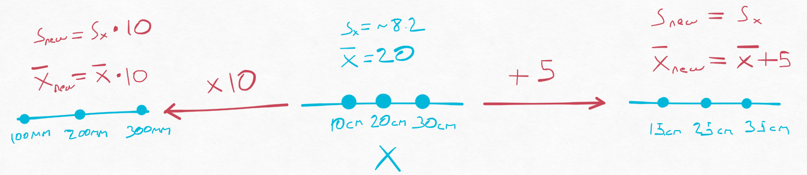

```{r setup, include=FALSE}
knitr::opts_chunk$set(echo = FALSE)
```

```{r}
library(tidyverse)
library(cowplot)
```

## Math with random variables

It is time we talk about some math(dört işlem) with random variables. As CLT indicates ([see the post](https://bstats.netlify.app/posts/2021-11-20-random-variables-and-distributions/)), we know that when sample size is large the means are distributed randomly. To illustrate the math with random variables more easily, let's consider we have the following measurements and let's assume that they are normally distributed: $X = (10cm, 20cm, 30cm)$. It has a mean $\bar{X}$ of 20 and sd $S_x$ of ~8.2. 

If we add or subtract a constant value from our random variable, the new mean $\bar{X}{new}$ becomes $\bar{X} + constant$ and our sd $S_x$ does not change since the average distance of the variables to the mean is still the same.

If we multiply our random variable $X$ with a constant, for example we converted our cm measurements to mm, the new mean $\bar{X}{new}$ becomes $\bar{X} * constant$ and our sd $S_x$ becomes also $S_{new} = S_x * constant$ (now the spread of our data points increased). 
 
```{r, layout="l-body-outset", fig.width=9, fig.height=9,fig.align='center', fig.cap= "Some math with random variables"}

```

So far it is clear I believe. So what if we sum or multiply our random variable $X$ with another random variable $Y$. This type of a calculation we encounter more. Generally we are interested in mean differences of two populations for example. Then we subtract these means right? Please note that, as our random variables, their mean and sd are also random variables. So let's see how the things will work out!

**The mean:**

As previously, when we sum or subtract the two random variables their mean also gets summed up or subtracted. So: $mean(X + Y) = \bar{X} + \bar{Y}$ or $mean(X - Y) = \bar{X} - \bar{Y}$. This was easy. 

**The Sd:**

This time we need to assume a few things and we will also work with variance. Variance is square of the sd $S_x^2$. The reason we will use variance instead of sd is that simply it makes the math much more simple.

If we skip the math we get this equation:

$$
Var(X+Y) = Var(X) + Var(Y) + 2Cov(X,Y)
$$

Here we see a new fellow: **Covariance** (*but we will get rid of him in a sec şşşşşş*). Which is:

$$
Cov(X,Y) = Cor(X,Y)*\sigma_X*\sigma_Y
$$

Here we see a more familiar face **Correlation**. It has come to tell us our first assumption, **our random variables should not correlate with each other**. 
Which means $Cor(X,Y) = 0$, 
which makes $Cov(X,Y) = 0$, 
which results in:

$$
Var(X+Y) = Var(X) + Var(Y)
$$
This tells us that variance of the sum of $X$ and $Y$ is equal to sum of their variances. **GIVEN they are not correlated**.

### Example for sum of variances
```{r, echo=T}
set.seed(1)

# Almost not correlated random variables:
x <- runif(n = 100, min = 10,max = 50)
y <- runif(n = 100, min = 60,max = 100)


# Correlated random variables:
a <- 1:100
b <- seq(50,200, length.out=100)
```
**When random variables are not correlated:** 

Cor(X,Y) = `r round(cor(x,y),2 )`

almost no correlation.

var(x) + var(y) = `r round(var(x) + var(y),2 )`

var(x + y) = `r round(var(x + y),2 )`

close enough!

**When random variables are correlated:** 

Cor(a,b) = `r round(cor(a,b),2 )`

full correlation

var(a) + var(b) = `r round(var(a) + var(b),2 )`

var(a + b) = `r round(var(a + b),2 )`

As you can see when our random variables were correlated our variance estimate was way off.

## In practice

So in practice we compare the mean differences to a distribution. In the first post[the first post](https://bstats.netlify.app/posts/2021-11-07-post/) we had calculated the null distribution by taking unreal amount of samples from the population. Now we will do it using *statistics*.

To calculate a test statistic we divide the random variable with its standard deviation. This, in theory gives us a normal distribution with mean = 0 and sd = 1 ^[(standard normal distribution)] (given high sample size)^[CLT]. This also allows us to standardize the data. Even if the original data values are at the range of thousands, we standardize it to a standard distribution.  

$$
\frac{\bar{X}-\bar{Y}}{sd_{XY}}
$$  

1. Here note that both numerator and denominator are random variables.

2. As we have seen above if we subtract two random variables, their mean also gets subtracted, hence numerator. (we are using sample means as an estimate of the real population means.)

3. We also saw that when we subtracted two random variables the new variance is equal to the sum of the individual variances. Thus $sd_{XY}$ will be equal to $\sqrt{\frac{s_X^2}{M} + \frac{s_Y^2}{N}}$ where M and N are sample sizes of random variables X and Y. 

4. If sample size is high, according to CLT our random variables will be also normal. Thus the parameters at the numerator and denominator will be also normal^[In the first post when we plotted the mean differences we saw that they were normally distributed]. 

5. The issue is division of two normal values may not be normal. This is due to the fact that we can underestimate the sd^[(denominator)] (Especially when the sample size is low). Thus our probability of observing bigger test statistic values increases. (see the Illustration section at the bottom) 

This change in probabilities creates a new distribution, that we know as **Student's t distribution**. [More on the story](https://en.wikipedia.org/wiki/William_Sealy_Gosset)

This is the final version of our statistic. Mean difference of the random variables divided by its standard deviation^[aka SEM] ^[Since in this example we are comparing two random variables, if we do a t-test it would be called two sample t-test]. 

$$
\frac{\bar{X}-\bar{Y}}{\sqrt{\frac{s_X^2}{M} + \frac{s_Y^2}{N}}}
$$  

<aside>
William Sealy Gosset

```{r,fig.align ='center', fig.cap= "https://en.wikipedia.org/wiki/William_Sealy_Gosset"}
knitr::include_graphics("images/Gosset.jpg")
```
</aside>

CLT is dependent on high sample size. Our estimate of variances are accurate when the sample size is high and thus the test statistic follows a standard normal distribution. However it does not account for the underestimation of variance when our sample size is not that high. t-distribution looks similar to normal distribution formula but it also comes with an additional flavor called **degrees of freedom (df)**, that accounts for this. Where $df = n - 1$     

```{r, layout="l-body-outset", fig.width=12, fig.height=6, fig.cap= "t-distribution with different degrees of freedom, code from: https://stackoverflow.com/questions/49236741/plot-student-s-t-distribution-with-degrees-of-freedom", preview = T}
x <- seq(-3, 3, length=1000)
hx <- dnorm(x)

degf <- c(1, 2, 5, 10)
colors <- c("red", "blue", "darkgreen", "gold", "black")
labels <- c("df=1", "df=2", "df=5", "df=10", "normal")

plot(x, hx, type="l", lty=1, xlab="t value",
     ylab="Density", main="Comparison of t Distributions")

for (i in 1:4){

  if (i == 1) {
    lines(x, dt(x,degf[1]), lwd=3, col=colors[1])
  } 
  else
  {
    lines(x, dt(x,degf[i]), lwd=1, col=colors[i])
  }
}

legend("topleft", inset=.05, title="Distributions",
       labels, lwd=1, lty=c(1, 1, 1, 1, 1), col=colors)
```

For the small sample sizes, distribution becomes more wide(higher tails, red line) and it accounts for the higher probability of observing extremes^[Probability of observing extremes increases, because we tend to underestimate the true variance at low sample size, as I discussed above]. As the sample size increases t-distribution also starts to resemble the normal distribution.


## Illustration: sample size vs normality

Here I will directly use the code from the book "Data Analysis for the Life Sciences" to show it [@dals]. Here we have a population of mice, half treated with a control diet other half treated with different diet and we compare their weights. From each group we take samples and calculate the mean difference of our samples. We repeat this 10000 times. We will compare different sample sizes: 3, 12, 25 and 50. 

```{r, layout="l-body-outset", fig.width=9, fig.height=3, fig.cap= "Mean differences"}
library(rafalib)

dat <- read.csv("mice_pheno.csv") #file was previously downloaded

controlPopulation <- filter(dat,Sex == "F" & Diet == "chow") %>%  
  select(Bodyweight) %>% unlist
hfPopulation <- filter(dat,Sex == "F" & Diet == "hf") %>%  
  select(Bodyweight) %>% unlist

mu_hf <- mean(hfPopulation)
mu_control <- mean(controlPopulation)
print(mu_hf - mu_control)


Ns <- c(3,12,25,50)
B <- 10000 #number of simulations
res <-  sapply(Ns,function(n) {
  replicate(B,mean(sample(hfPopulation,n))-mean(sample(controlPopulation,n)))
})

mypar(1,4)

for (i in seq(along=Ns)) {
  qqnorm(res[,i],main=Ns[i])
  qqline(res[,i],col=2)
}
```

Here we see with quantile plots, how our mean differences compare to a normal distribution.$\bar{X}-\bar{Y}$  We can see that even at sample size of 3 our differences are relatively normal. This is mainly due to the fact that weight is a relatively normally distributed factor. Since the population is normal our samples are also normal. Thus we see a good fit even with low sample size. 

However as I talked about it above, we also divide mean difference of random variables with its sd. $\frac{\bar{X}-\bar{Y}}{\sqrt{\frac{s_X^2}{M} + \frac{s_Y^2}{N}}}$  For the next plot, we divide mean differences with its sd. We repeat this 10000 times. Now we see that ratio of these two random variables indeed deviate from normal at normal distribution at low sample size. At even sample size of 12 we see some deviation at the edges. At the higher sample sizes it again fit to normal distribution.     

```{r, layout="l-body-outset", fig.width=9, fig.height=3, fig.cap= "Mean differences divided by standard deviations"}
mypar(1,4)

Ns <- c(3,12,25,50)
B <- 10000 #number of simulations
##function to compute a t-stat
computetstat <- function(n) {
  y <- sample(hfPopulation,n)
  x <- sample(controlPopulation,n)
  (mean(y)-mean(x))/sqrt(var(y)/n+var(x)/n)
}
res <-  sapply(Ns,function(n) {
  replicate(B,computetstat(n))
})


for (i in seq(along=Ns)) {
  qqnorm(res[,i],main=Ns[i])
  qqline(res[,i],col=2)
}
```

