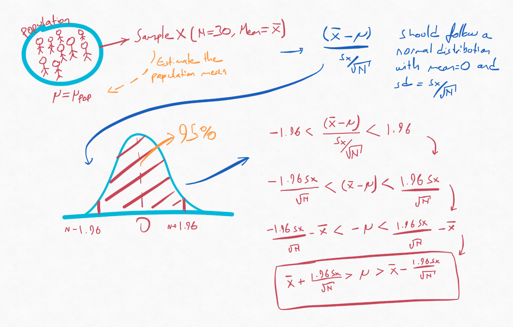

```{r setup, include=FALSE}
knitr::opts_chunk$set(echo = FALSE)
```

## Problem with p-values

P-values are informative but on its own it can be ambiguous. With enough sample size one can detect even the smallest difference and can say that the observed difference is significant. But is a minuscule difference relevant or interesting? Thus often it is actually more interesting to focus on the effect size (or maybe biological relevance). The degree of the observed difference. 

Another thing one can look into is *confidence intervals*, which can inform us about the effect size and the uncertainty of our estimate.

First we can calculate a confidence interval for a population mean estimate and then we can focus on the calculation of a confidence interval for difference of 2 samples.

From a population with a mean $\mu_{pop}$ we can take a sample of 30 (N = 30). With N of 30 we can apply CLT, that states that mean of the sampling $\bar{X}$ should follow a normal distribution with the mean of $\mu_{pop}$ and with standard error of around $\frac{sd_X}{\sqrt{N}}$. 

Our mean estimate of the population is a random variable and by using a confidence interval we can indicate the variability in our estimate.

So lets calculate the 95% confidence interval (95% CI) for our estimate. 95% CI would tell us that with probability of 95% our interval would fall on the true population parameter that we are estimating. (Note that it does not mean the opposite, that true value would fall in this interval 95% of the time.) 

Since we used CLT, we are dealing with a normal distribution. Specifically a standard normal distribution as given by the following formula: $\frac{\bar{X} - \mu_{pop}}{\frac{sd_X}{\sqrt{N}}}$ (which was discussed in previous posts). Standard normal distribution is a normal distribution with mean = 0 and sd = 1. If we take the 95% of the area under this normal distribution we would see that it would encapsulate the area starting from -1.96 to 1.96.     

$$
-1.96 < \frac{\bar{X} - \mu_{pop}}{\frac{sd_X}{\sqrt{N}}} < 1.96
$$
So probability of our estimate to fall in these regions is 95%. If we arrange it further we would get:

$$
\bar{X} - \frac{1.96sd_X}{\sqrt{N}} < \mu_{pop} < \bar{X} + \frac{1.96sd_X}{\sqrt{N}}
$$
So as the definition stated: *With probability of 95%, our interval would include the true population parameter that we are estimating.* In other words, the population parameter is a fixed value and the range of the CI is defined by random variables. This defined range covers the population parameter 95% of the time.

```{r,fig.align ='center', fig.cap= "Confidence Interval", preview=TRUE}

```

If we had used the CLT with low sample size instead of 30 for example, then CLT would not be accurate since our samplings would deviate from normal distribution and our estimate of 95% CI would include the population parameter less than 95% of the time. In this case we would normally use t-test. T distribution has larger tails so using it will give us a bigger 95% CI, because now the null distribution will cover a larger area to encapsulate the 95% of the area. So in the end if we were to calculate the 95% area according to the t distribution we would get an accurate 95% CI.

## Confidence Intervals and p-values

Let's say you are interested in two mean differences. $\bar{X} - \bar{Y}$. Let's call this difference *d*. Suppose we calculate a 95% CI for this difference *d* according to the t-distribution and we get:

$$
d - \frac{2sd_d}{\sqrt{N}} < 0 < d + \frac{2sd_d}{\sqrt{N}}
$$

If this interval fails to include the the 0, then it would mean either the lower bound is bigger than 0 or the upper bound is smaller than 0. $d - \frac{2sd_X}{\sqrt{N}} > 0$ and $d + \frac{2sd_X}{\sqrt{N}} < 0$ respectively. If we arrange the equation, this would also mean $\frac{d}{\frac{sd_d}{\sqrt{N}}} > 2$ or $\frac{d}{\frac{sd_d}{\sqrt{N}}} < 2$. Considering that $d = \bar{X} - \bar{Y}$,  $\frac{\bar{X} - \bar{Y}}{\frac{sd_d}{\sqrt{N}}}$ is the t-test statistic (t value). Coincidentally when the t-test statistic is bigger than 2 (arbitrary here) it also means $p < 0.05$. Likewise if we calculated 99% CI, we would get a result like: $t > constant$ where a t value bigger than this constant would indicate $p < 0.01$ in a t value table.

In the next post I will look into power calculations.


*Fun fact: I started writing this post exactly one year ago and then I stopped. I looked at it and finished only now...*

