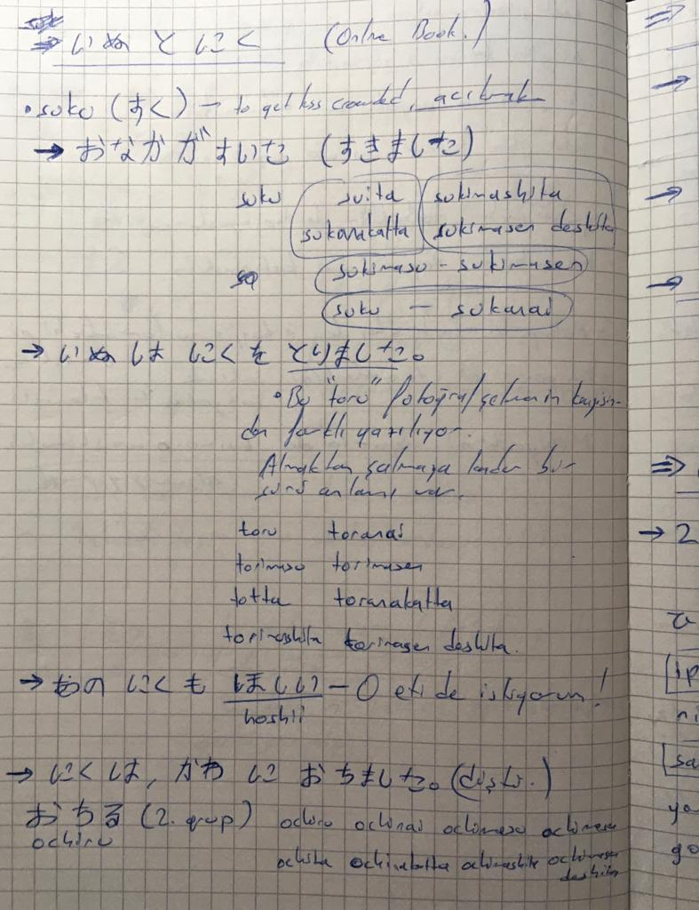
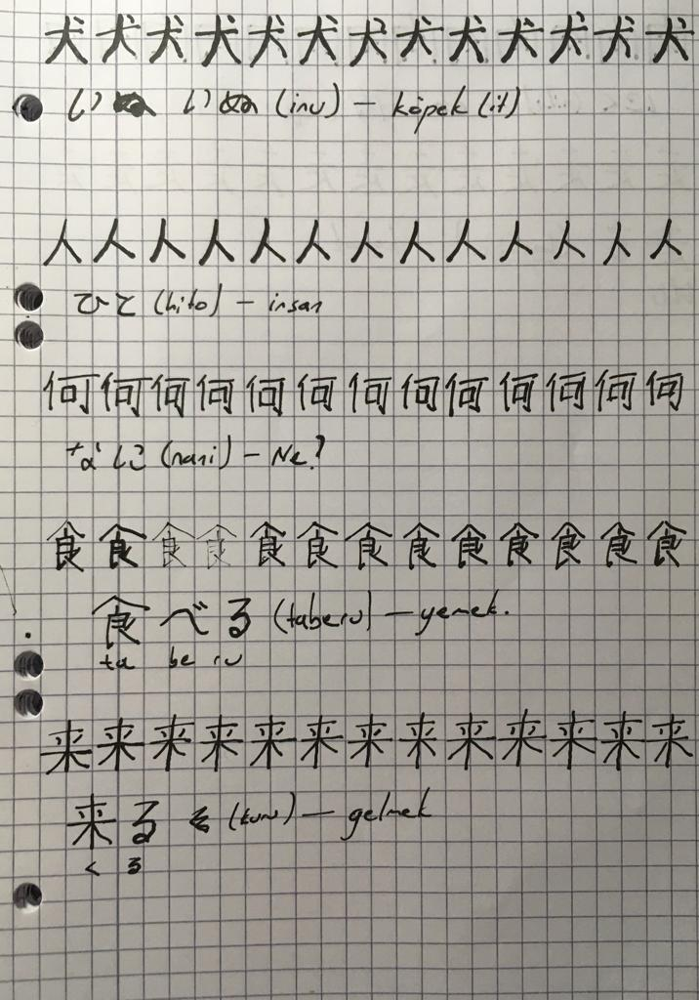

```{r setup, include=FALSE}
knitr::opts_chunk$set(echo = FALSE)
```

# Japonca yolundaki gelişmeler

Bir önceki yazıda Asialogy'nin video serisini bitirmeye çalıştığımdan bahsetmiştim. Bitiridim. Bunun üzerine planladığım gibi Genki kitabına geçtim ve yaklaşık 4-5 ünite bitirdim. Fakat, dil bilgisi kitabını takip etmek sonunda yan etkisini gösterdi ve sıkılıp bıraktım. Dil bilgisi kitabına çok daha eğlenceli bir alternatif olarak [çok güzel bir Japonca e-kitap sitesi](https://tadoku.org/japanese/free-books/#l0) buldum. Bu site çok hoşuma gitti çünkü başlangıç seviyesi için çok kısa ve basit hikayeler var. Daha önce bir dili öğrenmeye başladığımda bu kadar erkenden kitap okumayı denemeyi hiç düşünmemiştim. Hep bu *graded reader* dedikleri seviyelere ayrılmış dil kitaplarına dilde ilerledikten sonra bakmıştım. Fakat doğru seviyede kaynak bulunabilirse oldukça eğlenceli ve faydalı bir aktivite aslında. Bir de Japonca'nın farklı bir alfabeye(lere) sahip olduğunu düşünürsek; kitap okumak, okumada akıcılaşmak için de oldukça yardımcı olacaktır. Bu arada kitap dediğime bakmayın bu sitedeki 0. seviye kitaplar daha çok çizgi roman tarzında ve sayfa başına maksimum 2-3 cümle var. O yüzden insanı gerçekten yormuyor.

"Peki dil bilgisini nasıl pekiştireceğim?" diye sorabilir insan kendine. Ben de sordum ve şöyle bir yaklaşım geliştirdim sevgili güzel okuyucu:

1.  Kitabı baştan sona okuyorum (hiçbir bilmediğim kelimenin anlamına bakmadan).
2.  Sonra başa dönüyorum ve tekrar okuyorum ama bu sefer anlamadığım kelime ve kalıplara bakıyorum.
3.  İlginç ve faydalı bulduğum kalıpları defterime yazıyorum.
4.  **Yazdığım kalıpları derinlemesine inceliyorum.** 

İşte bu son aşamayı dilbilgisini pekiştirmek için kullanıyorum. Daha iyi anlatabilmek için aşağıdaki örnek sayfaya bakabiliriz. Mesela kitaptan ilk olarak *"おなかがすいた (onaka ga suita) -- karnım acıktı"* diye bir kalıp yazımışım. Sonra araştırmışım ve "suita"nın "suku" fiilinin çekimi olduğunu bulmuşum. Daha sonra da kendime, Asialogy'den not aldığım dilbiligisi notlarına ya da internete dayanarak bu fiili farklı zamanlara çekmişim. Sayfanın kalanında, not aldığım diğer fiillere de aynı yaklaşımı sergilediğimi görebilirsiniz. Tabii bu sadece fiillerle de sınırlı değil. Mesela bir sıfat yazdıysanız, bunun bir -i sıfatı mı yoksa -na sıfatı mı olduğuna bakabilir, olumlu olumsuz çekimlerini yapabilirsiniz. Ya da bir sayaç not almışsanız o sayacın farklı sayılarla kullanımına da bakabilirsiniz. Özetle ne kadar derine ineceğiniz size kalmış. 

```{r,fig.align ='center', fig.cap= "Örnek notlar"}

```

Şu an Japonca'ya bu şekilde yaklaşmaktan memnunum. Uzun bi süre böyle devam edip, sitedeki bütün bedava kitapları sömürm.. okumak istiyorum. Sonra eğer sıkılırsam başka bir yol bulurum elbet. Şimdilik planım seviye sıfırdaki bütün ilginç bulduğum kitapları bitirmek, sonra okuduğum kitaplara geri dönüp aldığım notları tekrar ederim diye düşünüyorum, bakalım.

Ayrıca bu küçük çizgi romancıkları okurken kanji öğrenmek fikrimsi de aklıma geldi tabii ki. O yüzden ilk okuduğum kitaptan başlayarak önemli bulduğum kanjileri yazmaya başladım bugün (aşağıdaki gibi). Böylece bir yandan da daha önce gördüğüm kalıpları da tekrar edeceğim. Kanjileri not ettikten sonra çizgi romanı baştan sonra tekrar okuyacağım ama bu sefer kanjilerin üstündeki yazılara (furigana) bakmadan, yazdığım kanjilerin gözünün içine baka baka, varlıklarını kabul ede ede geçeceğim kelimeleri. Gerisini onlar düşünsün.

Kanji öğrenmek gerçekten eğlenceli aslında. Düşününce, bir fikri ya da nesneyi bir takım "sembollerle" ifade etmek çok hoş bir his veriyor. çizim yapmak gibi rahatlatıcı bir etkisi var. Tabii uzun vadede kanji ile yazabilecek seviyede olmak istiyor muyum bilmiyorum (iyi olurdu tabii hehe) ama öncelikle okuyabilmek isterim tabii ki. Okuyabilmek için de kanjiyi görünce tanımak gerekiyor. O yüzden yazarak çalışmak bence en doğru ve eğlenceli yol. İnsan hem daha içselleştiriyor, hem de terapatik etkisi bilen var. 

Bu yazdığım kanji notlarını düzenli olarak tekrar etmeyecekmişim gibi bir his var içimde, doğrudur. Büyük bir ihtimalle, bu kanjilerle tekrar karşılaştıkça tekrar ederim, pekiştirmek için ama bu da yeterli olur kanımca. Kendimi de daha önce yaptığım gibi sıkmam, sıkıştırmam.


```{r,fig.align ='center', fig.cap= "Kanji çalışması"}

```

# Almanca ve İtalyanca'daki gelişmeler.

Bu iki dilde de konuşmamı geliştirmekte zorlanıyorum. Konuşacak bir partner bulmakta zorlandığım için kendi kendime bu işi nasıl kotarırım diye düşün düşün düşünüpduruum nezmandır. Kendi kendine gününü anlatmak, yaptığın şeyleri anlatmak bir süre sonra monotonlaşıyor. Bu işi daha çeşitlendirmek için bir yöntem, izlediğin ya da okuduğun bir şeyi kendine anlatmak. Ya da [Robin MacPherson'ın](https://www.youtube.com/@RobinMacPhersonFilms) da bi videosunda bahsettiği gibi, kendini karakterlerin birinin yerine koymak ya da  bir podcastte oradaki bir konuk gibi davranmak. Ben de buna bir şans vereyim dedim tekrardan, önceden çok da denememiştim bu yöntemi. Dinlediğim şeyi anlatma olarak bir süre uyguladım bunu. Zordu ama motive ediciydi. Fakat şimdi yine kendimi üşengeç hissediyorum bu konuda. Belki de hayal gücümü biraz daha devreye sokup Robin'in yaptığı gibi kendimi olayın içindeymişim gibi canlandırmalıyım. 

Bunun dışında hobilerimi ve dil öğrenme planımı da bir kez daha şekillendirdim. Özellikle Japonca'nın da işin içine girmesiyle her üç dile her gün zaman ayırma fikrini kafamın bir köşesinden süpürdüm. Hani zaten yapamıyordum üçünü bir günde o ayrı bir konu. Şimdiki planıma göre İtalyanca ve Almanca'ya bir gün biri öbür gün öbürü şeklinde değişimli olarak bakacağım, Japonca'ya ise her gün. Hoş bu plan İtalyanca ve Almanca için az çok işlediyse de her gün Japonca bakamadım şu ana kadar. 

İtalyanca ve Almanca'yı da planlı olarak öğrenmiyordum bir süredir. Bunun için de belli bir kaynağı defalarca dinleme metodunu uygulamayı karar verdim. İtalyanca için [Tintoria Podcast'i](https://www.youtube.com/@tintoriapodcast), Almanca için de  [Coldmirror'ın 5 Minuten Harry Podcast'i](https://www.youtube.com/@coldmirror) dinliyorum. Bununla beraber, sadece daha çok konuşmam lazım. Bi de geçen, buradan çıkan bilmediğim güzel kalıpları da Anki'ye kaydedeyim diye bir gaz geldi, birkaç kelime kaydettim ama hiç bakmadım. Galiba Anki gerçekten bana göre değil. Şimdilik Notion'a yazıyorum. 

Özetle böyle... Vaktim olsaydı Brezilya Portekizcesi ve Farsça öğrenmek isterdim ama uzak bir gelecekte belki. Şu an öğrendiklerimde akıcı seviyeye ulaşsam da yeter gibi. 
